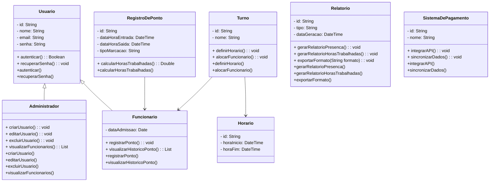

# sistema-ponto-eletronico

```mermaid
classDiagram
    class Usuario {
        - id: String
        - nome: String
        - email: String
        - senha: String
        + autenticar(): Boolean
        + recuperarSenha(): void
    }
    
    class Administrador {
        + criarUsuario(): void
        + editarUsuario(): void
        + excluirUsuario(): void
        + visualizarFuncionarios(): List<Funcionario>
    }
    Usuario <|-- Administrador
    
    class Funcionario {
        - dataAdmissao: Date
        + registrarPonto(): void
        + visualizarHistoricoPonto(): List<RegistroDePonto>
    }
    Usuario <|-- Funcionario
    
    class RegistroDePonto {
        - id: String
        - dataHoraEntrada: DateTime
        - dataHoraSaida: DateTime
        - tipoMarcacao: String
        + calcularHorasTrabalhadas(): Double
    }
    RegistroDePonto --> Funcionario

    class Horario {
        - id: String
        - horaInicio: DateTime
        - horaFim: DateTime
    }
    
    class Turno {
        - id: String
        - nome: String
        + definirHorario(): void
        + alocarFuncionario(): void
    }
    Turno --> Horario
    Turno --> Funcionario
    
    class Relatorio {
        - id: String
        - tipo: String
        - dataGeracao: DateTime
        + gerarRelatorioPresenca(): void
        + gerarRelatorioHorasTrabalhadas(): void
        + exportarFormato(String formato): void
    }
    
    class SistemaDePagamento {
        - id: String
        - nome: String
        + integrarAPI(): void
        + sincronizarDados(): void
    }
    
    Usuario : +autenticar()
    Usuario : +recuperarSenha()
    Administrador : +criarUsuario()
    Administrador : +editarUsuario()
    Administrador : +excluirUsuario()
    Administrador : +visualizarFuncionarios()
    Funcionario : +registrarPonto()
    Funcionario : +visualizarHistoricoPonto()
    RegistroDePonto : +calcularHorasTrabalhadas()
    Turno : +definirHorario()
    Turno : +alocarFuncionario()
    Relatorio : +gerarRelatorioPresenca()
    Relatorio : +gerarRelatorioHorasTrabalhadas()
    Relatorio : +exportarFormato()
    SistemaDePagamento : +integrarAPI()
    SistemaDePagamento : +sincronizarDados()

```