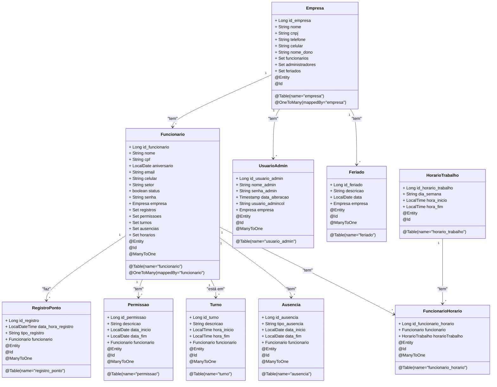

# sistema-ponto-eletronico

```mermaid
classDiagram
    class Empresa {
        + Long id_empresa
        + String nome
        + String cnpj
        + String telefone
        + String celular
        + String nome_dono
        + Set<Funcionario> funcionarios
        + Set<UsuarioAdmin> administradores
        + Set<Feriado> feriados
    }
    Empresa : @Entity
    Empresa : @Table(name="empresa")
    Empresa : @Id
    Empresa : @OneToMany(mappedBy="empresa")

    class Funcionario {
        + Long id_funcionario
        + String nome
        + String cpf
        + LocalDate aniversario
        + String email
        + String celular
        + String setor
        + boolean status
        + String senha
        + Empresa empresa
        + Set<RegistroPonto> registros
        + Set<Permissao> permissoes
        + Set<Turno> turnos
        + Set<Ausencia> ausencias
        + Set<FuncionarioHorario> horarios
    }
    Funcionario : @Entity
    Funcionario : @Table(name="funcionario")
    Funcionario : @Id
    Funcionario : @ManyToOne
    Funcionario : @OneToMany(mappedBy="funcionario")

    class UsuarioAdmin {
        + Long id_usuario_admin
        + String nome_admin
        + String senha_admin
        + Timestamp data_alteracao
        + String usuario_admincol
        + Empresa empresa
    }
    UsuarioAdmin : @Entity
    UsuarioAdmin : @Table(name="usuario_admin")
    UsuarioAdmin : @Id
    UsuarioAdmin : @ManyToOne

    class Feriado {
        + Long id_feriado
        + String descricao
        + LocalDate data
        + Empresa empresa
    }
    Feriado : @Entity
    Feriado : @Table(name="feriado")
    Feriado : @Id
    Feriado : @ManyToOne

    class RegistroPonto {
        + Long id_registro
        + LocalDateTime data_hora_registro
        + String tipo_registro
        + Funcionario funcionario
    }
    RegistroPonto : @Entity
    RegistroPonto : @Table(name="registro_ponto")
    RegistroPonto : @Id
    RegistroPonto : @ManyToOne

    class Permissao {
        + Long id_permissao
        + String descricao
        + LocalDate data_inicio
        + LocalDate data_fim
        + Funcionario funcionario
    }
    Permissao : @Entity
    Permissao : @Table(name="permissao")
    Permissao : @Id
    Permissao : @ManyToOne

    class HorarioTrabalho {
        + Long id_horario_trabalho
        + String dia_semana
        + LocalTime hora_inicio
        + LocalTime hora_fim
    }
    HorarioTrabalho : @Entity
    HorarioTrabalho : @Table(name="horario_trabalho")
    HorarioTrabalho : @Id

    class Turno {
        + Long id_turno
        + String descricao
        + LocalTime hora_inicio
        + LocalTime hora_fim
        + Funcionario funcionario
    }
    Turno : @Entity
    Turno : @Table(name="turno")
    Turno : @Id
    Turno : @ManyToOne

    class Ausencia {
        + Long id_ausencia
        + String tipo_ausencia
        + LocalDate data_inicio
        + LocalDate data_fim
        + Funcionario funcionario
    }
    Ausencia : @Entity
    Ausencia : @Table(name="ausencia")
    Ausencia : @Id
    Ausencia : @ManyToOne

    class FuncionarioHorario {
        + Long id_funcionario_horario
        + Funcionario funcionario
        + HorarioTrabalho horarioTrabalho
    }
    FuncionarioHorario : @Entity
    FuncionarioHorario : @Table(name="funcionario_horario")
    FuncionarioHorario : @Id
    FuncionarioHorario : @ManyToOne

    Empresa "1" --> "*" Funcionario : "tem"
    Empresa "1" --> "*" UsuarioAdmin : "tem"
    Empresa "1" --> "*" Feriado : "tem"
    Funcionario "1" --> "*" RegistroPonto : "faz"
    Funcionario "1" --> "*" Permissao : "tem"
    Funcionario "1" --> "*" Turno : "está em"
    Funcionario "1" --> "*" Ausencia : "tem"
    Funcionario "1" --> "*" FuncionarioHorario : "tem"
    HorarioTrabalho "1" --> "*" FuncionarioHorario : "tem"


```