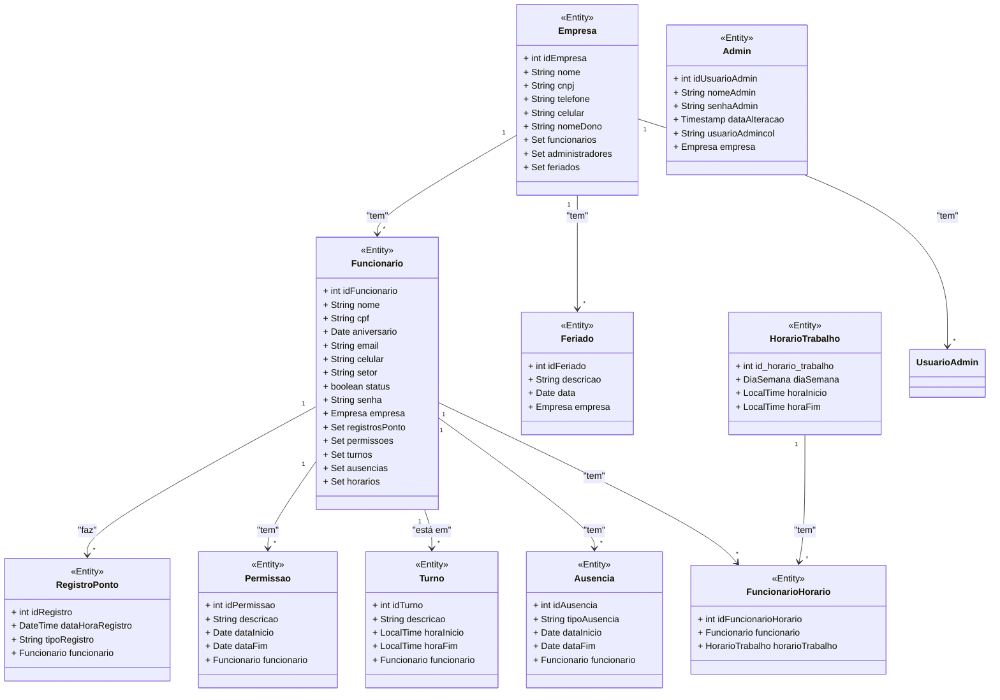

# sistema-ponto-eletronico

```mermaid
classDiagram
    class Empresa {
        <<Entity>>
        + int idEmpresa
        + String nome
        + String cnpj
        + String telefone
        + String celular
        + String nomeDono
        + Set<Funcionario> funcionarios
        + Set<UsuarioAdmin> administradores
        + Set<Feriado> feriados
    }

    class Funcionario {
        <<Entity>>
        + int idFuncionario
        + String nome
        + String cpf
        + Date aniversario
        + String email
        + String celular
        + String setor
        + boolean status
        + String senha
        + Empresa empresa
        + Set<RegistroPonto> registrosPonto
        + Set<Permissao> permissoes
        + Set<Turno> turnos
        + Set<Ausencia> ausencias
        + Set<FuncionarioHorario> horarios
    }

    class Admin {
        <<Entity>>
        + int idUsuarioAdmin
        + String nomeAdmin
        + String senhaAdmin
        + Timestamp dataAlteracao
        + String usuarioAdmincol
        + Empresa empresa
    }

    class Feriado {
        <<Entity>>
        + int idFeriado
        + String descricao
        + Date data
        + Empresa empresa
    }

    class RegistroPonto {
        <<Entity>>
        + int idRegistro
        + DateTime dataHoraRegistro
        + String tipoRegistro
        + Funcionario funcionario
    }

    class Permissao {
        <<Entity>>
        + int idPermissao
        + String descricao
        + Date dataInicio
        + Date dataFim
        + Funcionario funcionario
    }

    class HorarioTrabalho {
        <<Entity>>
        + int id_horario_trabalho
        + DiaSemana diaSemana
        + LocalTime horaInicio
        + LocalTime horaFim
    }

    class Turno {
        <<Entity>>
        + int idTurno
        + String descricao
        + LocalTime horaInicio
        + LocalTime horaFim
        + Funcionario funcionario
    }

    class Ausencia {
        <<Entity>>
        + int idAusencia
        + String tipoAusencia
        + Date dataInicio
        + Date dataFim
        + Funcionario funcionario
    }

    class FuncionarioHorario {
        <<Entity>>
        + int idFuncionarioHorario
        + Funcionario funcionario
        + HorarioTrabalho horarioTrabalho
    }

    Empresa "1" --> "*" Funcionario : "tem"
    Empresa "1" --> "*" UsuarioAdmin : "tem"
    Empresa "1" --> "*" Feriado : "tem"
    Funcionario "1" --> "*" RegistroPonto : "faz"
    Funcionario "1" --> "*" Permissao : "tem"
    Funcionario "1" --> "*" Turno : "está em"
    Funcionario "1" --> "*" Ausencia : "tem"
    Funcionario "1" --> "*" FuncionarioHorario : "tem"
    HorarioTrabalho "1" --> "*" FuncionarioHorario : "tem"


```