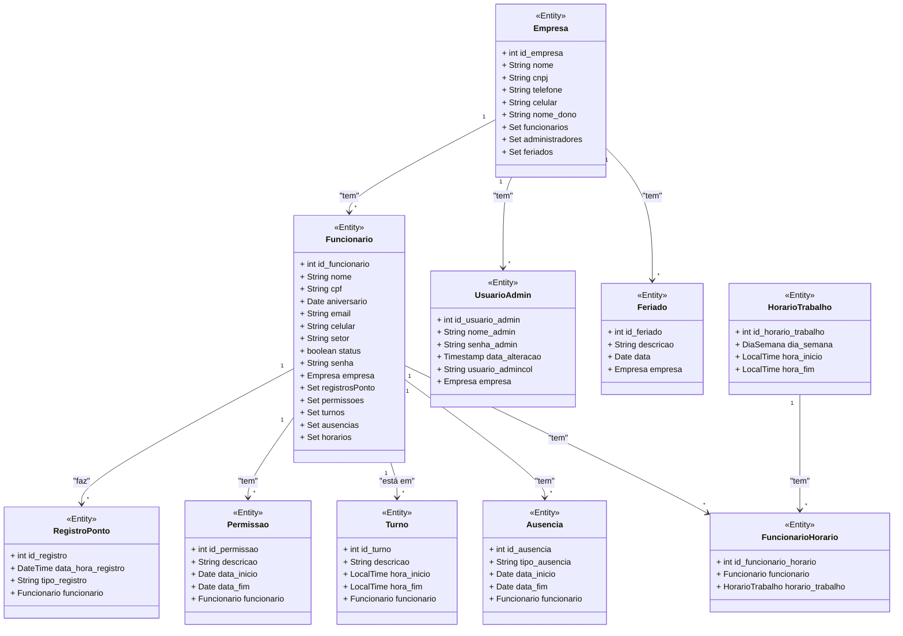

# sistema-ponto-eletronico

```mermaid
classDiagram
    class Empresa {
        <<Entity>>
        + int id_empresa
        + String nome
        + String cnpj
        + String telefone
        + String celular
        + String nome_dono
        + Set<Funcionario> funcionarios
        + Set<UsuarioAdmin> administradores
        + Set<Feriado> feriados
    }

    class Funcionario {
        <<Entity>>
        + int id_funcionario
        + String nome
        + String cpf
        + Date aniversario
        + String email
        + String celular
        + String setor
        + boolean status
        + String senha
        + Empresa empresa
        + Set<RegistroPonto> registrosPonto
        + Set<Permissao> permissoes
        + Set<Turno> turnos
        + Set<Ausencia> ausencias
        + Set<FuncionarioHorario> horarios
    }

    class UsuarioAdmin {
        <<Entity>>
        + int id_usuario_admin
        + String nome_admin
        + String senha_admin
        + Timestamp data_alteracao
        + String usuario_admincol
        + Empresa empresa
    }

    class Feriado {
        <<Entity>>
        + int id_feriado
        + String descricao
        + Date data
        + Empresa empresa
    }

    class RegistroPonto {
        <<Entity>>
        + int id_registro
        + DateTime data_hora_registro
        + String tipo_registro
        + Funcionario funcionario
    }

    class Permissao {
        <<Entity>>
        + int id_permissao
        + String descricao
        + Date data_inicio
        + Date data_fim
        + Funcionario funcionario
    }

    class HorarioTrabalho {
        <<Entity>>
        + int id_horario_trabalho
        + DiaSemana dia_semana
        + LocalTime hora_inicio
        + LocalTime hora_fim
    }

    class Turno {
        <<Entity>>
        + int id_turno
        + String descricao
        + LocalTime hora_inicio
        + LocalTime hora_fim
        + Funcionario funcionario
    }

    class Ausencia {
        <<Entity>>
        + int id_ausencia
        + String tipo_ausencia
        + Date data_inicio
        + Date data_fim
        + Funcionario funcionario
    }

    class FuncionarioHorario {
        <<Entity>>
        + int id_funcionario_horario
        + Funcionario funcionario
        + HorarioTrabalho horario_trabalho
    }

    Empresa "1" --> "*" Funcionario : "tem"
    Empresa "1" --> "*" UsuarioAdmin : "tem"
    Empresa "1" --> "*" Feriado : "tem"
    Funcionario "1" --> "*" RegistroPonto : "faz"
    Funcionario "1" --> "*" Permissao : "tem"
    Funcionario "1" --> "*" Turno : "está em"
    Funcionario "1" --> "*" Ausencia : "tem"
    Funcionario "1" --> "*" FuncionarioHorario : "tem"
    HorarioTrabalho "1" --> "*" FuncionarioHorario : "tem"


```